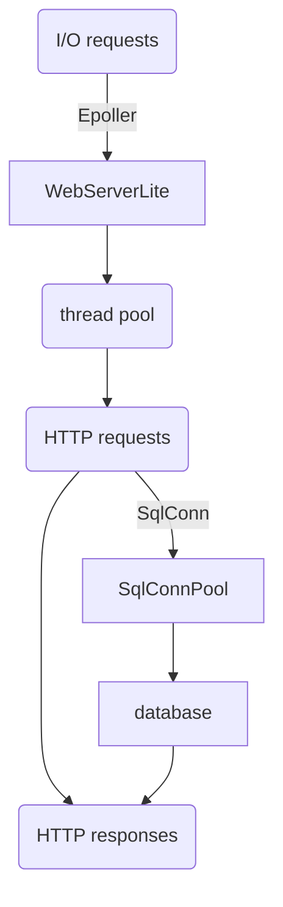
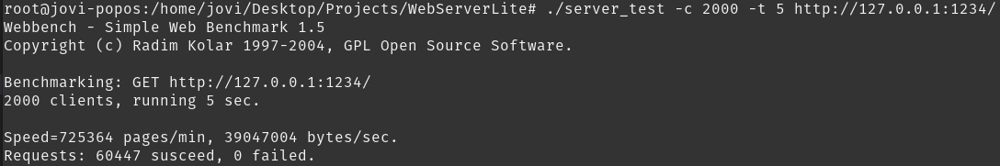
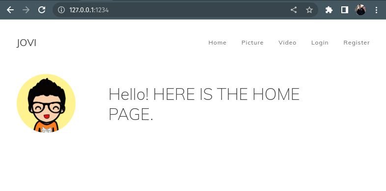

# WebServerLite

## Introduction
WebServerLite is a high-performance HTTP web server in C++14. Many functionalities are integrated into it including 
* resolving HTTP messages to support GET and POST primitives by state machine
* supporting concurrent requests by non-blocking socket and multiplexing I/O
* register and login user interface
* Asynchronized logging system
* responsing request for images and videos


## Prerequisites
* OS: ubuntu 22.04
* tools: 
  * g++ 11.2.0
  * make 4.3

* libraries: 
  * mysql-server 
  * mysql-client 
  * libmysqlclient-dev 
  * libntirpc-dev


## Framework

The diagram below shows the data flow from a request by a client to a response by the WebServerLite.




## Benchmark

To test the performance of WebServerLite on your computer, you can input following command 

```shell
make test
./server_test -c 2000 -t 5 http://127.0.0.1:1234/
```

through terminal in your root path of WebServerLite. And you can also use options to adjust the configuration of this test as following.

```text
 -f|--force               Don't wait for reply from server.
 -r|--reload              Send reload request - Pragma: no-cache.
 -t|--time <sec>          Run benchmark for <sec> seconds. Default 30.
 -p|--proxy <server:port> Use proxy server for request.
 -c|--clients <n>         Run <n> HTTP clients at once. Default one.
 -9|--http09              Use HTTP/0.9 style requests.
 -1|--http10              Use HTTP/1.0 protocol.
 -2|--http11              Use HTTP/1.1 protocol.
 --get                    Use GET request method.
 --head                   Use HEAD request method.
 --options                Use OPTIONS request method.
 --trace                  Use TRACE request method.
 -?|-h|--help             This information.
 -V|--version             Display program version.
```

The performance of WebServerLite in our test can be shown after you input the above commands and wait few seconds.




## Installation

To install prerequisites on Debian system, you can input following command.

```shell
sudo apt install mysql-server mysql-client libmysqlclient-dev libntirpc-dev
```

After install the mysql database, we should add record to our database for login.

```sql
create database WebServerLite;

USE WebServerLite;
CREATE TABLE user(
    username char(50) NULL,
    password char(50) NULL
)ENGINE=InnoDB;

INSERT INTO user(username, password) VALUES('root', '1234');
```

And then compiler the WebServerLite from the source code.

```shell
make
```

Because we need root authentication to connect to the mysql database, so input the next command.

```shell
sudo -i
```

Finally, we can run our HTTP web server by inputing command.

```shell
./server
```

Open browser and see the home page.



